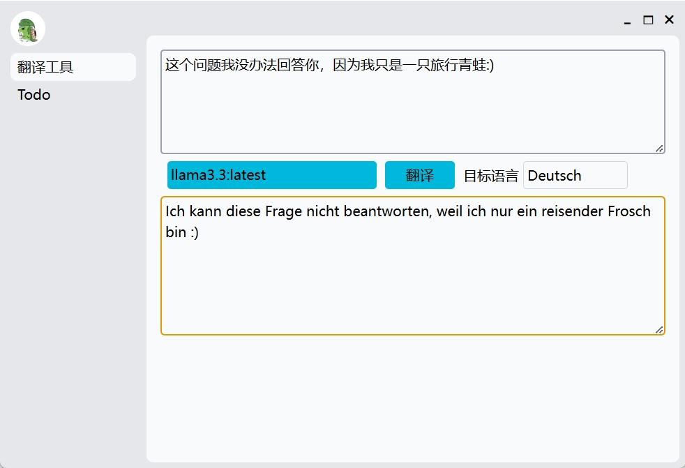

# Mo7  

一个基于`Electron`+`Lit`+`TailwindCSS` 的本地客户端。尽量减少依赖，同时保证页面尚可接受。  
> 项目名称来自于《WALL·E》中的扫地机器人`M-O/毛` 的第七张图片。[详见Pixar 官网。](https://www.pixar.com/wall-e)  
> ~~可惜担心侵权就没用相关的图标元素~~  




### 安装依赖:

```bash
# bun
bun install  

# npm
npm install 
```

### 开发调试

```bash
# 首先要启动dev:css 并保持运行
bun run dev:css  
# 或
npm run dev:css

# 然后启动dev
bun run dev
# 或
npm run dev  
```  

### 打包  
```bash
bun run dist
# 或
npm run dist  
```  

## 其他资源  
1. 自定义组件参考：[https://www.creative-tim.com/twcomponents](https://www.creative-tim.com/twcomponents/components/dropdowns)  

### OllamaJS  

```bash
# Node 版本的Chroma 不支持内存数据库，所以需要通过pip 安装然后启动服务  
chroma run  --path /path
```

This project was created using `bun init` in bun v1.2.2. [Bun](https://bun.sh) is a fast all-in-one JavaScript runtime.
